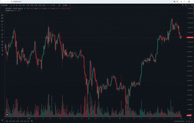

# TradingView Charting Library JSAPI 连接币安数据源

- [TradingView 开发文档](https://zlq4863947.gitbook.io/tradingview/3-shu-ju-bang-ding/js-api)
- [币安文档](https://developers.binance.com/docs/zh-CN/binance-spot-api-docs)

## 演示

## How to start

1. Check that you can view
   [https://github.com/tradingview/charting_library/](https://github.com/tradingview/charting_library/).
   If you do not have access then you can
   [request access to this repository here](https://www.tradingview.com/HTML5-stock-forex-bitcoin-charting-library/).
1. Install dependencies `npm install`.
1. Copy the charting library files
   1. If you are able to run bash scripts then the
      `copy_charting_library_files.sh` script can be used to copy the current
      stable version's files.
   1. If you are not able to run bash scripts then do the following:
      1. Copy the `charting_library` folder from
         [https://github.com/tradingview/charting_library/](https://github.com/tradingview/charting_library/)
         to `/public` folder.
      1. Copy the `datafeeds` folder from
         [https://github.com/tradingview/charting_library/](https://github.com/tradingview/charting_library/)
         to `/public`.
1. Run `npm run dev`. It will build the project and open a default browser
   with the Charting Library.
1. Run `npm run build` when you are ready to build the Vue application for deployment.

## 联系

<b>闲聊和白嫖勿扰，不接受无偿问答</b>

## 打赏

